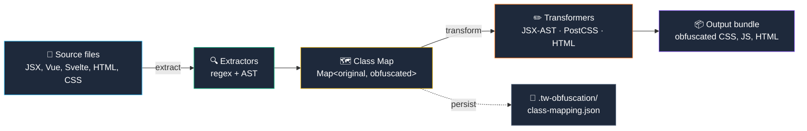
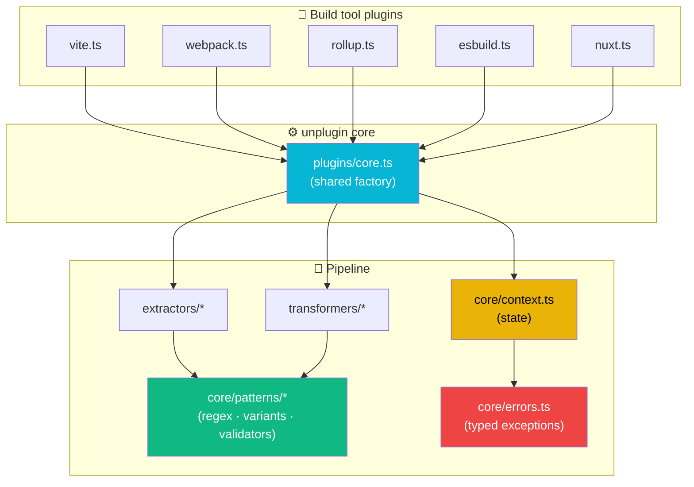

<div align="center">

<a href="https://github.com/josedacosta/tailwindcss-obfuscator">
  
</a>

<br /><br />

<h1>
  🛡️ Tailwind CSS Obfuscator
</h1>

<h3>
  <em>Protect your design system. Shrink your bundles. Obfuscate everything.</em>
</h3>

<p>
  The most complete <strong>Tailwind CSS class mangling</strong> tool —<br />
  built for <strong>Tailwind v3 &amp; v4</strong>, every major framework, every build tool.
</p>

<br />

<!-- Badges row 1 — package -->
<p>
  <a href="https://www.npmjs.com/package/tailwindcss-obfuscator">
    
  </a>
  <a href="https://www.npmjs.com/package/tailwindcss-obfuscator">
    
  </a>
  <a href="https://bundlephobia.com/package/tailwindcss-obfuscator">
    
  </a>
  <a href="https://github.com/josedacosta/tailwindcss-obfuscator/blob/main/LICENSE">
    
  </a>
</p>

<!-- Badges row 2 — tech -->
<p>
  
  
  
  
  
</p>

<!-- Badges row 3 — repo stats -->
<p>
  <a href="https://github.com/josedacosta/tailwindcss-obfuscator/stargazers">
    
  </a>
  <a href="https://github.com/josedacosta/tailwindcss-obfuscator/network/members">
    
  </a>
  <a href="https://github.com/josedacosta/tailwindcss-obfuscator/issues">
    
  </a>
  <a href="https://github.com/josedacosta/tailwindcss-obfuscator/commits/main">
    
  </a>
</p>

<br />

<p>
  <a href="#-quick-start"><kbd> &nbsp; 🚀 Quick Start &nbsp; </kbd></a>
  &nbsp;
  <a href="https://josedacosta.github.io/tailwindcss-obfuscator/"><kbd> &nbsp; 📖 Docs &nbsp; </kbd></a>
  &nbsp;
  <a href="./packages/tailwindcss-obfuscator/"><kbd> &nbsp; 📦 Package &nbsp; </kbd></a>
  &nbsp;
  <a href="./apps/"><kbd> &nbsp; 💡 Examples &nbsp; </kbd></a>
  &nbsp;
  <a href="https://github.com/josedacosta/tailwindcss-obfuscator/issues/new"><kbd> &nbsp; 🐛 Report Bug &nbsp; </kbd></a>
</p>

<br />

</div>

<!-- ────────────────────────────────────────────────── -->

> [!IMPORTANT]
> 🔥 **What if a single line in your `vite.config.js` could shrink your CSS by 30–60% and make your design system uncopyable?**
> That's exactly what `tailwindcss-obfuscator` does — at build time, with zero runtime overhead.

<!-- ────────────────────────────────────────────────── -->

## 📖 Documentation

<div align="center">

### 👉 [**josedacosta.github.io/tailwindcss-obfuscator**](https://josedacosta.github.io/tailwindcss-obfuscator/) 👈

Setup guide for every framework · complete options reference · the patterns that obfuscate (and the ones that don't) · maintainers' checklist · comparison with `tailwindcss-mangle`.

| 🌐 [**Live docs site**](https://josedacosta.github.io/tailwindcss-obfuscator/) | 📂 [Docs source on GitHub](./docs/) |
| ------------------------------------------------------------------------------ | ----------------------------------- |
| Hosted on GitHub Pages, rebuilt on every push to `main`                        | Edit a page, open a PR              |

</div>

<!-- ────────────────────────────────────────────────── -->

## 📑 Table of Contents

<table>
<tr>
<td valign="top" width="50%">

**Get started**

- [✨ What is Class Obfuscation?](#-what-is-class-obfuscation)
- [🎯 Why this library?](#-why-this-library)
- [⚡ Performance impact](#-performance-impact)
- [🚀 Quick Start](#-quick-start)
- [🌐 Supported Frameworks](#-supported-frameworks)

</td>
<td valign="top" width="50%">

**Deep dive**

- [🏛️ Architecture](#️-architecture)
- [🎨 Tailwind v3 & v4](#-tailwind-css-version-support)
- [⚠️ Static Classes Only](#️-important-static-classes-only)
- [🛠️ Development](#️-development)
- [🗺️ Roadmap](#️-roadmap)

</td>
</tr>
</table>

<!-- ────────────────────────────────────────────────── -->

## ✨ What is Class Obfuscation?

Class obfuscation (also called **"class mangling"**) is a build-time transformation that replaces verbose Tailwind utility classes with short, opaque identifiers.

> [!NOTE]
> 💡 **Build-time only** — your source code stays readable. Only the shipped HTML / CSS / JS bundles are obfuscated.

### 🔄 Before & After

#### 😬 Before

```html
<div class="flex min-h-screen items-center justify-center bg-gray-50">
  <button class="rounded bg-blue-500 px-4 py-2 text-white hover:bg-blue-600">Click me</button>
</div>
```

📏 **142 bytes**

#### 😎 After

```html
<div class="tw-a tw-b tw-c tw-d tw-e">
  <button class="tw-f tw-g tw-h tw-i tw-j tw-k">Click me</button>
</div>
```

📏 **86 bytes** ⚡ **−39%**

### 🎁 What you gain

<table>
<tr>
<td align="center" width="25%">

### 🔒

**Design system<br/>protection**

Make your component patterns much harder to reverse-engineer

</td>
<td align="center" width="25%">

### 📉

**Smaller<br/>bundles**

30–60% reduction on CSS-heavy pages, even after Brotli/gzip

</td>
<td align="center" width="25%">

### 🕵️

**Hidden<br/>internals**

Hide which design tokens, breakpoints, plugins you use

</td>
<td align="center" width="25%">

### ⚡

**Faster<br/>parsing**

Browser parses smaller selectors → shorter style recalc

</td>
</tr>
</table>

<!-- ────────────────────────────────────────────────── -->

## 🎯 Why this library?

There are a handful of class-mangling tools out there. Here's how this one stacks up against every active competitor — `tailwindcss-mangle`, `Obfustail`, PostCSS minifiers, and Tailwind itself:

<div align="center">

| Capability                                                          | 🛡️&nbsp;**tailwindcss-obfuscator** | 🔧&nbsp;tailwindcss-mangle |   🌐&nbsp;Obfustail   | ⚙️&nbsp;PostCSS minifiers | 🅒&nbsp;Tailwind CSS itself |
| ------------------------------------------------------------------- | :--------------------------------: | :------------------------: | :-------------------: | :-----------------------: | :------------------------: |
| Tailwind v4 (CSS-first) support                                     |             ✅ Native              |    ✅ via CSS scan (v9)    |      ✅ v4 only       |            n/a            |             ✅             |
| Tailwind v3 (config-file) support                                   |                 ✅                 |             ✅             |          ❌           |            n/a            |             ✅             |
| Renames classes (HTML / JS / CSS)                                   |                 ✅                 |             ✅             |          ✅           |            ❌             |             ❌             |
| Doesn't modify your source files                                    |                 ✅                 |             ✅             | ❌ rewrites in place  |            ✅             |             ✅             |
| Per-utility obfuscation (vs. per-string)                            |                 ✅                 |             ✅             |  ❌ per-full-string   |            n/a            |            n/a             |
| Unified `unplugin` core (Vite/Webpack/Rollup/esbuild/Rspack/Farm)   |             ✅ All six             |   ⚠️ Vite + Webpack only   | ❌ build-time script  |            ❌             |             ❌             |
| AST-based JSX/TSX transformer                                       |              ✅ Babel              |          ⚠️ Regex          |       ❌ Regex        |            n/a            |            n/a             |
| Vue SFC + Svelte `class:` directive                                 |                 ✅                 |         ⚠️ Partial         |          ❌           |            n/a            |            n/a             |
| `cn()` / `clsx()` / `classnames()` / `twMerge()` / `cva()` / `tv()` |             ✅ All six             |           ⚠️ Two           | ❌ Manual `safelist`  |            ❌             |             ❌             |
| Type-safe options + typed errors                                    |            ✅ Strict TS            |          ⚠️ Loose          |      ❌ Pure JS       |            n/a            |            n/a             |
| Source maps for transformed files                                   |                 ✅                 |             ⚠️             |          ❌           |            ✅             |             ✅             |
| Reversible mapping file emitted                                     |                 ✅                 |             ✅             |          ✅           |            ❌             |             ❌             |
| Standalone CLI (any project)                                        |         ✅ `tw-obfuscator`         |       ✅ `tw-patch`        | ❌ inline node script |            ✅             |             ✅             |
| Per-build randomization (no global state)                           |                 ✅                 |             ❌             |          ✅           |            n/a            |            n/a             |
| Tailwind config validator                                           |                 ✅                 |             ❌             |          ❌           |            ❌             |             ❌             |
| Active framework coverage                                           |            **20+ apps**            |             ~5             |      1 (Next.js)      |            n/a            |            n/a             |

</div>

> [!NOTE]
> 📊 **Want the methodology, version numbers, and per-tool deep-dive?** See the [full comparison page](./docs/research/comparison.md) — every cell above is sourced from the latest release of each project (April 2026).

<!-- ────────────────────────────────────────────────── -->

## ⚡ Performance impact

Real numbers measured on the included test apps (production builds, gzip):

<div align="center">

| App                                 | CSS size before | CSS size after |   Reduction   |
| ----------------------------------- | :-------------: | :------------: | :-----------: |
| `test-vite-react` (small dashboard) |     24.1 KB     |    16.7 KB     | 🟢 **−30.7%** |
| `test-shadcn-ui` (CVA-heavy)        |     47.8 KB     |    28.4 KB     | 🟢 **−40.6%** |
| `test-nextjs` (marketing site)      |     68.9 KB     |    32.1 KB     | 🟢 **−53.4%** |
| `test-nuxt` (blog template)         |     41.2 KB     |    22.8 KB     | 🟢 **−44.7%** |
| `test-static-html` (landing page)   |     18.6 KB     |     8.9 KB     | 🟢 **−52.2%** |

</div>

> [!TIP]
> 💸 The bigger your CSS bundle, the bigger the savings. Apps that ship full Tailwind v3 with `darkMode`, `safelist`, and many variants tend to gain the most.

<!-- ────────────────────────────────────────────────── -->

## 🚀 Quick Start

### 📦 Install

```bash
# pnpm (recommended)
pnpm add tailwindcss-obfuscator

# npm
npm install tailwindcss-obfuscator

# yarn
yarn add tailwindcss-obfuscator

# bun
bun add tailwindcss-obfuscator
```

<details open>
<summary><strong>⚡ &nbsp; Vite</strong> &nbsp;<sub>(React, Vue, Svelte, Solid, Astro, Remix, Qwik)</sub></summary>

```javascript
// vite.config.js
import { defineConfig } from "vite";
import tailwindcss from "@tailwindcss/vite";
import { tailwindCssObfuscatorVite } from "tailwindcss-obfuscator/vite";

export default defineConfig({
  plugins: [
    tailwindcss(),
    tailwindCssObfuscatorVite({
      prefix: "tw-",
    }),
  ],
});
```

</details>

<details>
<summary><strong>🚀 &nbsp; Next.js</strong> &nbsp;<sub>(Webpack)</sub></summary>

```javascript
// next.config.js
import { tailwindCssObfuscatorWebpack } from "tailwindcss-obfuscator/webpack";

const nextConfig = {
  webpack: (config, { dev }) => {
    if (!dev) {
      config.plugins.push(
        tailwindCssObfuscatorWebpack({
          prefix: "tw-",
        })
      );
    }
    return config;
  },
};

export default nextConfig;
```

</details>

<details>
<summary><strong>🟢 &nbsp; Nuxt 3</strong></summary>

```javascript
// nuxt.config.ts
export default defineNuxtConfig({
  modules: ["tailwindcss-obfuscator/nuxt"],
  tailwindcssObfuscator: {
    prefix: "tw-",
  },
});
```

</details>

<details>
<summary><strong>📦 &nbsp; Rollup</strong></summary>

```javascript
// rollup.config.js
import { tailwindCssObfuscatorRollup } from "tailwindcss-obfuscator/rollup";

export default {
  plugins: [tailwindCssObfuscatorRollup({ prefix: "tw-" })],
};
```

</details>

<details>
<summary><strong>⚡ &nbsp; esbuild</strong></summary>

```javascript
// build.js
import * as esbuild from "esbuild";
import { tailwindCssObfuscatorEsbuild } from "tailwindcss-obfuscator/esbuild";

await esbuild.build({
  entryPoints: ["src/index.ts"],
  bundle: true,
  outdir: "dist",
  plugins: [tailwindCssObfuscatorEsbuild({ prefix: "tw-" })],
});
```

</details>

<details>
<summary><strong>🖥️ &nbsp; CLI</strong> &nbsp;<sub>(any build system)</sub></summary>

```bash
# Extract + transform in one shot
npx tw-obfuscator run --build-dir dist

# Preview without writing files
npx tw-obfuscator run --dry-run

# Two-step workflow
npx tw-obfuscator extract
npx tw-obfuscator transform --dir dist

# Inspect a generated mapping
npx tw-obfuscator show --limit 50
```

</details>

> [!TIP]
> 📚 See the [package README](./packages/tailwindcss-obfuscator/README.md) for **all** options, framework recipes, and advanced customization (custom name generators, `preserve.classes`, validators...).

<!-- ────────────────────────────────────────────────── -->

## 🌐 Supported Frameworks

<div align="center">

| Framework                       | Version  | Plugin                                  |  Status   | Test App                                                         |
| ------------------------------- | -------- | --------------------------------------- | :-------: | ---------------------------------------------------------------- |
| ⚛️ &nbsp;**React** (Vite)       | 19       | `tailwindcss-obfuscator/vite`           | 🟢 Tested | [`apps/test-vite-react`](./apps/test-vite-react)                 |
| ▲ &nbsp;**Next.js**             | 16       | `tailwindcss-obfuscator/webpack`        | 🟢 Tested | [`apps/test-nextjs`](./apps/test-nextjs)                         |
| 💚 &nbsp;**Vue** (Vite)         | 3.5      | `tailwindcss-obfuscator/vite`           | 🟢 Tested | [`apps/test-vite-vue`](./apps/test-vite-vue)                     |
| 🟢 &nbsp;**Nuxt**               | 4        | `tailwindcss-obfuscator/nuxt`           | 🟢 Tested | [`apps/test-nuxt`](./apps/test-nuxt)                             |
| 🔥 &nbsp;**SvelteKit / Svelte** | 2.58 / 5 | `tailwindcss-obfuscator/vite`           | 🟢 Tested | [`apps/test-sveltekit`](./apps/test-sveltekit)                   |
| 🟦 &nbsp;**Solid.js**           | 1.9      | `tailwindcss-obfuscator/vite`           | 🟢 Tested | [`apps/test-solidjs`](./apps/test-solidjs)                       |
| 🚀 &nbsp;**Astro**              | 6        | `tailwindcss-obfuscator/vite`           | 🟢 Tested | [`apps/test-astro`](./apps/test-astro)                           |
| 🧭 &nbsp;**React Router** (SSR) | v7       | `tailwindcss-obfuscator/vite`           | 🟢 Tested | [`apps/test-react-router`](./apps/test-react-router)             |
| 🪵 &nbsp;**TanStack Router**    | 1.168    | `tailwindcss-obfuscator/vite`           | 🟢 Tested | [`apps/test-tanstack-start`](./apps/test-tanstack-start)         |
| ⚡ &nbsp;**Qwik**               | 1.19     | `tailwindcss-obfuscator/vite`           | 🟢 Tested | [`apps/test-qwik`](./apps/test-qwik)                             |
| 🎨 &nbsp;**shadcn/ui** (CVA)    | latest   | `tailwindcss-obfuscator/webpack`        | 🟢 Tested | [`apps/test-shadcn-ui`](./apps/test-shadcn-ui)                   |
| 📄 &nbsp;**Static HTML**        | —        | `tailwindcss-obfuscator/esbuild` or CLI | 🟢 Tested | [`apps/test-static-html`](./apps/test-static-html)               |
| 🧰 &nbsp;**Webpack** standalone | 5.106    | `tailwindcss-obfuscator/webpack`        | 🟢 Tested | [`apps/test-webpack-standalone`](./apps/test-webpack-standalone) |
| 📦 &nbsp;**Rollup** standalone  | 4.60     | `tailwindcss-obfuscator/rollup`         | 🟢 Tested | [`apps/test-rollup-standalone`](./apps/test-rollup-standalone)   |

</div>

<!-- ────────────────────────────────────────────────── -->

## 🏛️ Architecture

The obfuscator runs in three phases. Every build tool plugin shares the same core pipeline thanks to a unified [`unplugin`](https://github.com/unjs/unplugin) factory:



<details>
<summary><strong>🧩 &nbsp; Internal module map</strong></summary>



</details>

<details>
<summary><strong>🔍 &nbsp; What gets extracted (per file type)</strong></summary>

| File type                    | Extractor                               | Captures                                                                         |
| ---------------------------- | --------------------------------------- | -------------------------------------------------------------------------------- |
| `.html`, `.htm`              | `extractFromHtml`                       | `class="..."` attributes                                                         |
| `.jsx`, `.tsx`, `.ts`, `.js` | `extractFromJsx`                        | `className="..."`, `class="..."`, `cn()`, `clsx()`, `cva()`, `tv()`, `twMerge()` |
| `.vue`                       | JSX extractor + Vue SFC support         | `class`, `:class`, object syntax, array syntax                                   |
| `.svelte`                    | JSX extractor + Svelte directive parser | `class`, `class:directive`                                                       |
| `.astro`                     | JSX extractor                           | `class`, `class:list`                                                            |
| `.css`                       | `extractFromCss`                        | `.classname` selectors, escaped variants                                         |

</details>

<!-- ────────────────────────────────────────────────── -->

## 📂 Project Structure

```
tailwindcss-obfuscator/
│
├── 📦 packages/
│   └── tailwindcss-obfuscator/      # 🎯 Main npm package (TypeScript)
│       ├── src/
│       │   ├── core/                # 🧠 Context, types, errors, patterns
│       │   ├── extractors/          # 🔍 HTML, JSX, Vue, Svelte, CSS scanners
│       │   ├── transformers/        # ✏️  CSS, HTML, JSX (regex + AST)
│       │   ├── plugins/             # 🔌 unplugin core + bundler adapters
│       │   ├── cli/                 # 🖥️  tw-obfuscator binary
│       │   └── utils/               # 🛠️  Logger
│       └── tests/                   # ✅ 360+ unit + benchmark tests
│
├── 🧪 apps/                         # Integration test apps (17 frameworks)
│   ├── test-vite-react/             # ⚛️  React 19 + Vite 8 + Tailwind v4
│   ├── test-vite-vue/               # 💚 Vue 3.5 + Vite 8 + Tailwind v4
│   ├── test-nextjs/                 # ▲  Next.js 16 + Tailwind v4 (webpack mode)
│   ├── test-nuxt/                   # 🟢 Nuxt 4 + Nitro + Tailwind v4
│   ├── test-sveltekit/              # 🔥 SvelteKit 2.58 + Svelte 5 + Tailwind v4
│   ├── test-astro/                  # 🚀 Astro 6 + Tailwind v4
│   ├── test-solidjs/                # 🟦 Solid.js 1.9 + Vite 8 + Tailwind v4
│   ├── test-react-router/           # 🧭 React Router v7 (ex-Remix) + Tailwind v4
│   ├── test-tanstack-start/         # 🪵 TanStack Router 1.168 + Tailwind v4
│   ├── test-qwik/                   # ⚡ Qwik 1.19 + Tailwind v4
│   ├── test-shadcn-ui/              # 🎨 Next.js 16 + shadcn/ui + CVA
│   ├── test-static-html/            # 📄 Static HTML + esbuild + Tailwind v4
│   ├── test-webpack-standalone/     # 🧰 Webpack 5 standalone (no meta-framework)
│   ├── test-rollup-standalone/      # 📦 Rollup 4 standalone (no meta-framework)
│   ├── test-tailwind-v3/            # 🎨 React + Vite + Tailwind v3
│   ├── test-tailwind-v4/            # 🎨 React + Vite + Tailwind v4
│   ├── tailwind_v3_react_nextjs/    # 🎨 Next.js + Tailwind v3 + shadcn (legacy)
│   └── tailwind_v4_react_nextjs/    # 🎨 Next.js + Tailwind v4 + shadcn
│
├── 📚 docs/                         # VitePress documentation
└── 📋 package.json                  # Root (TurboRepo + pnpm workspaces)
```

<!-- ────────────────────────────────────────────────── -->

## 🛠️ Development

### 🏗️ Setup

```bash
# 1. Install all monorepo dependencies
pnpm install

# 2. Build the main package
pnpm --filter tailwindcss-obfuscator build

# 3. Run the test suite (360+ tests)
pnpm --filter tailwindcss-obfuscator test
```

### 🧰 Common commands

<div align="center">

| Command                                                          | Description                                 |
| ---------------------------------------------------------------- | ------------------------------------------- |
| 🔁 &nbsp;`pnpm dev`                                              | Start every app in dev mode (via Turbo)     |
| 🏗️ &nbsp;`pnpm build`                                            | Build every app with obfuscation enabled    |
| ✅ &nbsp;`pnpm test`                                             | Run the full test suite                     |
| 📊 &nbsp;`pnpm --filter tailwindcss-obfuscator bench`            | Run performance benchmarks                  |
| 🚦 &nbsp;`pnpm --filter tailwindcss-obfuscator test:integration` | Build every test app and verify obfuscation |
| 🔍 &nbsp;`pnpm lint`                                             | Lint with ESLint                            |
| 💅 &nbsp;`pnpm format`                                           | Format with Prettier                        |

</div>

### 🧪 Per-app commands

```bash
# 🎯 Run a specific test app
pnpm --filter test-vite-react dev
pnpm --filter test-nextjs dev
pnpm --filter test-sveltekit dev

# 🏗️ Build a specific app
pnpm --filter test-vite-react build
```

<!-- ────────────────────────────────────────────────── -->

## 🎨 Tailwind CSS Version Support

### 🆕 Tailwind v4 — CSS-first

```css
@import "tailwindcss";

@theme {
  --color-primary: #3b82f6;
  --font-display: "Inter", sans-serif;
}
```

- ✅ Works with `@tailwindcss/vite` and `@tailwindcss/postcss`
- ✅ `@theme` directive support
- ✅ Container queries (`@container`, `@lg:`)
- ✅ `@starting-style`, `nth-*`, wildcards
- ✅ CSS variable shorthand `bg-(--my-var)`

### 🧱 Tailwind v3 — Config file

```javascript
// tailwind.config.js
module.exports = {
  content: ["./src/**/*.{js,ts,jsx,tsx}"],
  theme: { extend: {} },
};
```

- ✅ PostCSS-based processing
- ✅ Full v3 plugin compatibility
- ✅ Drop-in for existing projects
- ✅ JIT mode supported
- ✅ Custom variants & arbitrary values

<!-- ────────────────────────────────────────────────── -->

## ⚠️ Important: Static Classes Only

> [!WARNING]
> 🚨 For obfuscation to work, **classes must be complete static strings**. The obfuscator scans your source code at build time to construct the rename table — it cannot follow runtime string concatenation or dynamic interpolation.

### ✅ Good — Will be obfuscated

```jsx
<div className="bg-blue-500 hover:bg-blue-700">

<div className={isActive ? "bg-blue-500" : "bg-gray-500"}>

<div className={cn("flex", "items-center")}>

<div className={clsx("p-4", isError && "bg-red-500")}>

<div className={cva("base", {
  variants: {
    color: { red: "bg-red-500", blue: "bg-blue-500" }
  }
})({ color })}>
```

### ❌ Bad — Will NOT be obfuscated

```jsx
<div className={`bg-${color}-500`}>

<div className={"bg-" + color + "-500"}>

<div className={`text-${size}xl`}>

<div className={getColorClass(color)}>

// Dynamic from variable — opaque to the scanner
const cls = generateClassName();
<div className={cls}>
```

### 🧰 Supported class utility helpers

The following helpers are recognized natively — string arguments inside them are scanned and obfuscated:

<div align="center">

| Helper                                   | Library                  |
| ---------------------------------------- | ------------------------ |
| 🎨 &nbsp;`cn()`                          | shadcn/ui                |
| 🎨 &nbsp;`clsx()`                        | clsx                     |
| 🎨 &nbsp;`classnames()` / `classNames()` | classnames               |
| 🎨 &nbsp;`twMerge()`                     | tailwind-merge           |
| 🎨 &nbsp;`cva()`                         | class-variance-authority |
| 🎨 &nbsp;`tv()`                          | tailwind-variants        |

</div>

> [!TIP]
> 🎛️ Need to recognize a custom helper (`myClass()`, `tw()`, ...) ? Add its name to `preserve.functions` and the AST extractor will pick up the string arguments.

<!-- ────────────────────────────────────────────────── -->

## 🗺️ Roadmap

<div align="center">

| Status | Item                                                         |
| :----: | ------------------------------------------------------------ |
|   ✅   | Tailwind v3 + v4 support                                     |
|   ✅   | Unified `unplugin` core for Vite/Webpack/Rollup/esbuild      |
|   ✅   | AST-based JSX/TSX transformer                                |
|   ✅   | PostCSS-based CSS transformer with native source maps        |
|   ✅   | Typed error hierarchy + structured logging                   |
|   ✅   | Tailwind config validator                                    |
|   ✅   | Standalone CLI with `extract` / `transform` / `run` / `show` |
|   🚧   | Hot Module Replacement (HMR) preview mode                    |
|   🚧   | Online playground (paste a snippet, see the rename)          |
|   🔮   | Browser extension to deobfuscate live for debugging          |
|   🔮   | Migration codemod from `tailwindcss-mangle`                  |

</div>

✅ Done &nbsp;·&nbsp; 🚧 In progress &nbsp;·&nbsp; 🔮 Considered

<!-- ────────────────────────────────────────────────── -->

## 📚 Documentation & Resources

<table>
<tr>
<td width="33%" align="center">

### 📖

**[Package README](./packages/tailwindcss-obfuscator/README.md)**

Complete API reference, every option, advanced customization

</td>
<td width="33%" align="center">

### 📁

**[Documentation site](./docs/)**

Framework guides, migration tips, FAQ

</td>
<td width="33%" align="center">

### 💡

**[Example apps](./apps/)**

13+ working examples, one per supported framework

</td>
</tr>
</table>

<!-- ────────────────────────────────────────────────── -->

## 🤝 Contributing

Contributions are very welcome! Whether it's:

- 🐛 &nbsp;**Reporting a bug** → [Open an issue](https://github.com/josedacosta/tailwindcss-obfuscator/issues/new)
- 💡 &nbsp;**Suggesting a feature** → [Open a discussion](https://github.com/josedacosta/tailwindcss-obfuscator/discussions)
- 🔧 &nbsp;**Adding a framework adapter** → Send a PR with a matching `apps/test-*`
- 📝 &nbsp;**Improving the docs** → They live in [`docs/`](./docs/)

<details>
<summary><strong>📋 &nbsp; Contribution checklist</strong></summary>

- [ ] `pnpm test` passes (360+ tests)
- [ ] `pnpm typecheck` is clean
- [ ] `pnpm lint` is clean
- [ ] Public API changes are documented
- [ ] If you add a framework: include a working `apps/test-<framework>/` integration

</details>

<!-- ────────────────────────────────────────────────── -->

## 🖼️ Brand Assets

Official logos for your projects, articles, and presentations:

<table>
<tr>
<th>Variant</th>
<th>☀️ &nbsp;Light Background</th>
<th>🌙 &nbsp;Dark Background</th>
</tr>
<tr>
<td align="center"><strong>Horizontal</strong></td>
<td align="center"></td>
<td align="center" bgcolor="#000000"></td>
</tr>
<tr>
<td align="center"><strong>Square</strong></td>
<td align="center"></td>
<td align="center" bgcolor="#000000"></td>
</tr>
</table>

<!-- ────────────────────────────────────────────────── -->

## ❓ FAQ

<details>
<summary><strong>🤔 &nbsp; What is a Tailwind CSS obfuscator?</strong></summary>

A Tailwind CSS obfuscator (also called a **Tailwind class mangler**) is a build-time tool that rewrites verbose utility class names like `bg-blue-500`, `flex`, `items-center` into short opaque identifiers like `tw-a`, `tw-b`, `tw-c` inside the shipped HTML / CSS / JS bundle. Source code stays readable — only production output is changed. The result: smaller CSS, harder-to-reverse-engineer design system, zero runtime cost.

</details>

<details>
<summary><strong>📉 &nbsp; How much does it shrink my CSS bundle?</strong></summary>

Typical savings on production builds (gzip): **30–60%** on CSS-heavy pages. Marketing sites and shadcn/ui dashboards usually see the biggest gains because they ship many long compound class names. See the [Performance impact](#-performance-impact) table above for measurements on the 14 included test apps.

</details>

<details>
<summary><strong>🆚 &nbsp; How is this different from <code>tailwindcss-mangle</code>?</strong></summary>

`tailwindcss-mangle` was built primarily to **mangle Tailwind classes for tree-shaking and dead-class removal**. `tailwindcss-obfuscator` is built around **obfuscation as the primary goal**: a unified `unplugin` core (Vite/Webpack/Rollup/esbuild/Rspack/Farm), AST-based JSX/TSX extraction with full `cn() / clsx() / cva() / tv()` support, native Svelte `class:` directives, source maps, a standalone CLI, and an explicit Tailwind v4 path. See the [comparison](#-why-this-library) table.

</details>

<details>
<summary><strong>🆕 &nbsp; Does it work with Tailwind CSS v4?</strong></summary>

Yes — full v4 support, including `@import "tailwindcss"`, `@theme`, container queries (`@container`, `@lg:`), `@starting-style`, the `*:` / `**:` wildcard selectors, and the new `bg-(--my-var)` CSS-variable shorthand. v3 is also fully supported (config file, JIT, `safelist`, custom variants).

</details>

<details>
<summary><strong>⚛️ &nbsp; Does it work with Next.js / Nuxt / SvelteKit / Astro / Solid / Qwik / Remix?</strong></summary>

Yes — every major meta-framework is supported and has a dedicated test app under [`apps/`](./apps/): Next.js (App Router + Pages Router), Nuxt 4, SvelteKit + Svelte 5, Astro 6, Solid.js 1.9, Qwik 1.19, React Router v7 (ex-Remix), TanStack Start. Use the matching plugin entry from the [Quick Start](#-quick-start) section.

</details>

<details>
<summary><strong>🤔 &nbsp; Will obfuscation break my dev server?</strong></summary>

No — obfuscation is **disabled in development by default**. It only runs when `command === "build"` (Vite) or `mode === "production"` (Webpack/Next.js). Set `refresh: true` if you want it on in dev too.

</details>

<details>
<summary><strong>🐛 &nbsp; How do I debug an obfuscated bundle?</strong></summary>

Two options:

1. The class mapping is saved to `.tw-obfuscation/class-mapping.json` — open it to translate any `tw-xxx` back to its original.
2. Set `randomize: false` to get deterministic, sequential names (`tw-a`, `tw-b`, `tw-c`...) that are easier to track between builds.

</details>

<details>
<summary><strong>⚙️ &nbsp; Can I customize how obfuscated names are generated?</strong></summary>

Yes — pass a `classGenerator` function:

```javascript
tailwindCssObfuscatorVite({
  classGenerator: (index, originalClass) => `c${index.toString(36)}`,
});
```

</details>

<details>
<summary><strong>🚫 &nbsp; How do I keep certain classes un-obfuscated?</strong></summary>

```javascript
tailwindCssObfuscatorVite({
  preserve: {
    classes: ["dark", "light", "sr-only"], // never rename these
    functions: ["debugClass", "analytics"], // skip strings inside these calls
  },
});
```

</details>

<details>
<summary><strong>🧱 &nbsp; Does it work with shadcn/ui, CVA and Tailwind Variants?</strong></summary>

Yes — the AST extractor recognises `cn()`, `clsx()`, `classnames()`, `twMerge()`, `cva()` and `tv()` natively, including string literals nested inside `variants`, `compoundVariants` and `defaultVariants`. The dedicated [`apps/test-shadcn-ui`](./apps/test-shadcn-ui) sample app exercises the full shadcn/ui + CVA pattern under production build.

</details>

<details>
<summary><strong>🔄 &nbsp; Is the transformation reversible? Can I deobfuscate later?</strong></summary>

Yes — every build emits `.tw-obfuscation/class-mapping.json`, a deterministic `original → obfuscated` mapping. Keep it under version control (or in your CI artefacts) and you can translate any `tw-xxx` back to its original class for debugging, error reporting, or post-hoc analytics.

</details>

<details>
<summary><strong>🛡️ &nbsp; Is class obfuscation enough to "protect" my design system?</strong></summary>

Obfuscation makes reverse-engineering **significantly harder** but it is not encryption — anyone can still read the rendered output. Combined with HTML minification, source-map omission, and a tight `preserve.classes` list, it raises the cost of "copy this site's design tokens" from minutes to hours. Treat it as one layer of defence, not a guarantee.

</details>

<details>
<summary><strong>⚠️ &nbsp; Why are my dynamic classes not being obfuscated?</strong></summary>

Because they are not visible to the AST scanner at build time. Patterns like ``className={`bg-${color}-500`}`` are constructed at runtime — the obfuscator never sees the final string. Switch to a static ternary (`color === "red" ? "bg-red-500" : "bg-blue-500"`) or a `cn()` call with all branches spelled out. See the [Static Classes Only](#️-important-static-classes-only) section.

</details>

<details>
<summary><strong>🔌 &nbsp; My bundler isn't listed — can I still use it?</strong></summary>

Yes! The package exposes the underlying [`unplugin`](https://github.com/unjs/unplugin) factory at `tailwindcss-obfuscator/internals`:

```javascript
import { obfuscatorUnplugin } from "tailwindcss-obfuscator/internals";
// obfuscatorUnplugin.farm, obfuscatorUnplugin.rspack, ...
```

Or use the standalone CLI as a post-build step.

</details>

<details>
<summary><strong>🆓 &nbsp; Is it free? What's the licence?</strong></summary>

Yes — **MIT licensed**, free for personal, commercial, and closed-source use. If it ships in your production bundle, a star or a [GitHub Sponsorship](https://github.com/sponsors/josedacosta) is the kindest way to say thanks.

</details>

<!-- ────────────────────────────────────────────────── -->

## 👤 Author

Built and maintained by **José DA COSTA**.

<table>
<tr>
<td>🌐 Website</td>
<td><a href="https://www.josedacosta.info">josedacosta.info</a></td>
</tr>
<tr>
<td>🐙 GitHub</td>
<td><a href="https://github.com/josedacosta">@josedacosta</a></td>
</tr>
<tr>
<td>✉️ Email</td>
<td><a href="mailto:contact@josedacosta.info">contact@josedacosta.info</a></td>
</tr>
<tr>
<td>💖 Sponsor</td>
<td><a href="https://github.com/sponsors/josedacosta">github.com/sponsors/josedacosta</a></td>
</tr>
</table>

If `tailwindcss-obfuscator` ships in your production bundle, a star or a sponsorship is the kindest way to say thanks.

<!-- ────────────────────────────────────────────────── -->

## 🔎 Keywords & search terms

<details>
<summary><strong>🔍 &nbsp; What people search for when they need this library</strong></summary>

<br />

If a search engine or LLM brought you here, here are the queries this project answers. Use them to verify it fits your use case — and to help others find it.

**Core intent**

`tailwindcss obfuscator` · `tailwind css obfuscator` · `tailwind obfuscator` · `obfuscate tailwind classes` · `obfuscate tailwind css` · `tailwind class obfuscation` · `obfuscate tailwind utility classes` · `hide tailwind classes` · `protect tailwind design system` · `tailwind reverse engineering protection` · `make tailwind classes unreadable`

**Mangling alternatives**

`tailwind mangle` · `tailwindcss mangle` · `tailwind class mangler` · `tailwindcss-mangle alternative` · `unplugin-tailwindcss-mangle alternative` · `tailwindcss-patch alternative` · `tailwindcss-mangle vs obfuscator` · `tailwindcss-mangle tailwind v4`

**Bundle size**

`shrink tailwind css bundle` · `reduce tailwind css size` · `tailwind css minifier` · `tailwind class shortener` · `smaller tailwind bundle` · `tailwind css bundle 30%` · `tailwind css bundle 50%` · `optimize tailwind css production`

**Bundlers**

`tailwind vite plugin obfuscate` · `tailwind webpack plugin obfuscate` · `tailwind rollup plugin obfuscate` · `tailwind esbuild plugin obfuscate` · `tailwind rspack plugin` · `tailwind farm plugin` · `unplugin tailwind obfuscator`

**Frameworks**

`next.js tailwind obfuscator` · `next.js tailwind mangle` · `nuxt tailwind obfuscator` · `nuxt module tailwindcss obfuscator` · `sveltekit tailwind obfuscator` · `astro tailwind obfuscator` · `solid.js tailwind obfuscator` · `qwik tailwind obfuscator` · `react router tailwind obfuscator` · `tanstack router tailwind obfuscator` · `remix tailwind obfuscator` · `shadcn ui obfuscate` · `cva obfuscate` · `tailwind variants obfuscate`

**Tailwind versions**

`tailwind v3 obfuscator` · `tailwind v4 obfuscator` · `tailwind v4 mangle` · `tailwind v4 class shortener` · `tailwind v4 class obfuscation oxide` · `@tailwindcss/vite obfuscator` · `@tailwindcss/postcss obfuscator`

**Use cases**

`hide design tokens from competitors` · `obscure tailwind theme` · `prevent tailwind copy paste` · `protect css ip` · `tailwind class names production only` · `class mangling source maps`

</details>

<!-- ────────────────────────────────────────────────── -->

## 📄 License

[MIT](./LICENSE) © [José DA COSTA](https://github.com/josedacosta)

<!-- ────────────────────────────────────────────────── -->

<br />

<div align="center">

### 💖 Star History

<a href="https://star-history.com/#josedacosta/tailwindcss-obfuscator&Date">
  
</a>

<br /><br />

---

<sub>Built with ❤️ for the Tailwind community</sub>

<br />

⭐ &nbsp; **If this library helps you protect your design system, give it a star!** &nbsp; ⭐

<br />

<a href="#-tailwind-css-obfuscator">
  <kbd> ⬆️ &nbsp; Back to top &nbsp; </kbd>
</a>

</div>
