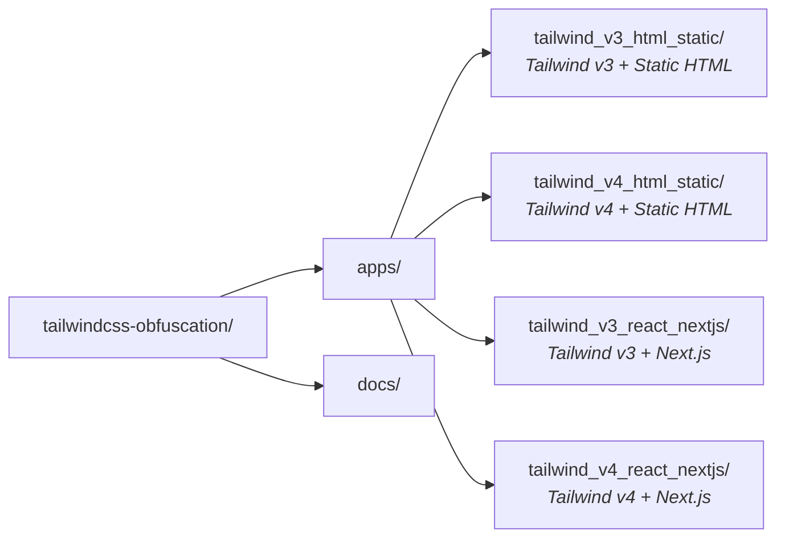

# Tailwind CSS Class Obfuscation - Overview

## Introduction

This monorepo demonstrates different approaches to obfuscating Tailwind CSS classes across various project types and Tailwind versions. Class obfuscation (also known as "class mangling") transforms readable class names like `bg-blue-500` into short, opaque names like `tw-a`, making it harder to reverse-engineer your CSS design system.

## Why Obfuscate CSS Classes?

1. **Intellectual Property Protection**: Hide your design system implementation details
2. **Reduced Bundle Size**: Shorter class names mean smaller CSS and HTML files
3. **Discourage Copying**: Makes it harder for competitors to copy your styling

## Project Structure



## Obfuscation Approaches by Project Type

| Project Type | Tailwind | Class Extraction  | Obfuscation                           |
| ------------ | -------- | ----------------- | ------------------------------------- |
| HTML Static  | v3       | tailwindcss-patch | unplugin-tailwindcss-mangle           |
| HTML Static  | v4       | Custom script     | unplugin-tailwindcss-mangle           |
| Next.js      | v3       | tailwindcss-patch | unplugin-tailwindcss-mangle (webpack) |
| Next.js      | v4       | Custom script     | unplugin-tailwindcss-mangle (webpack) |

## Key Differences: Tailwind v3 vs v4

### Tailwind v3

- Configuration via `tailwind.config.js`
- Uses PostCSS plugin
- `tailwindcss-patch` works for class extraction
- Import: `@tailwind base; @tailwind components; @tailwind utilities;`

### Tailwind v4

- CSS-first configuration with `@theme` and `@import "tailwindcss"`
- No `tailwind.config.js` required
- `tailwindcss-patch` does NOT work (see `tailwindcss_patch_v4_issues.md`)
- Requires custom extraction script
- New features: Container queries (`@container`), improved arbitrary values

## Quick Start

```bash
# Install dependencies
pnpm install

# Run all apps in development mode
pnpm dev

# Build all apps (with obfuscation)
pnpm build

# Run tests
pnpm test
```

## Documentation Files

- `overview.md` - This file
- `tailwind_v3_html_static.md` - Guide for Tailwind v3 + HTML static
- `tailwind_v4_html_static.md` - Guide for Tailwind v4 + HTML static
- `tailwind_v3_react_nextjs.md` - Guide for Tailwind v3 + Next.js
- `tailwind_v4_react_nextjs.md` - Guide for Tailwind v4 + Next.js
- `tailwindcss_patch_v4_issues.md` - Why tailwindcss-patch doesn't work with v4
- `compatibility_matrix.md` - Full compatibility matrix

## Important Rules

### Static Classes Only

For obfuscation to work, classes must be written as **complete static strings**:

```jsx
// BAD - Will NOT be obfuscated
<div className={`bg-${color}-500`}>
<div className={"bg-" + color}>

// GOOD - Will be obfuscated
<div className={color === 'red' ? 'bg-red-500' : 'bg-blue-500'}>
<div className="bg-red-500 bg-blue-500">
```

### Build Pipeline

1. **Extract Classes**: Scan source files for Tailwind classes
2. **Generate JSON**: Create a class list file
3. **Build**: Run the normal build process
4. **Obfuscate**: Replace class names with short versions

## Contributing

Each app is independent and can be modified without affecting others. When adding new obfuscation techniques, please update the relevant documentation file.
