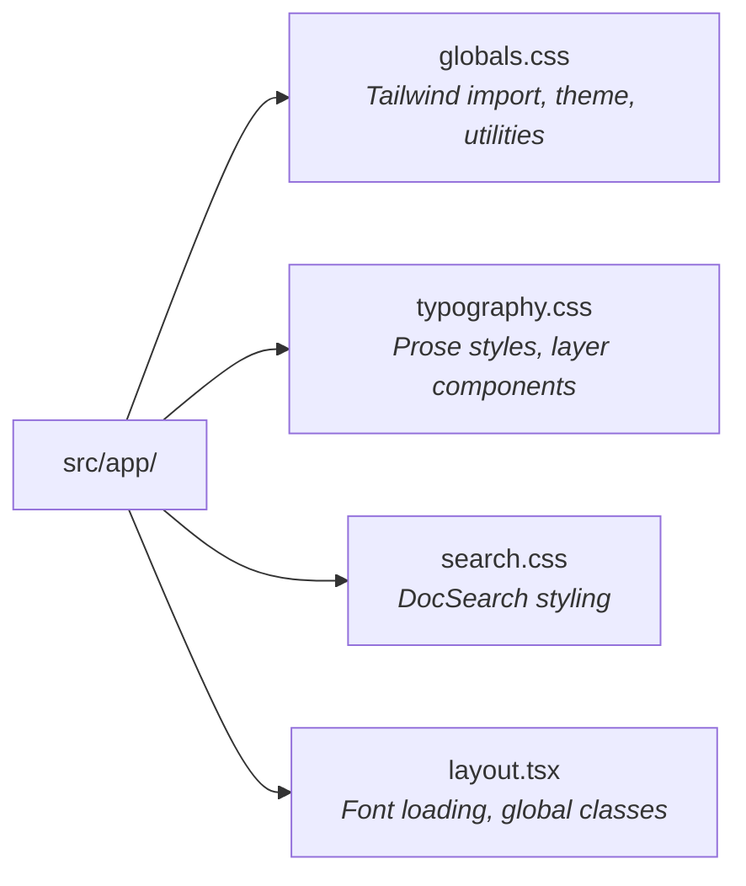

# Tailwind CSS Website Design System

This page documents the Design System used on the official **tailwindcss.com** website, extracted directly from their [GitHub repository](https://github.com/tailwindlabs/tailwindcss.com).

## Brand Assets

Official brand assets are available at [tailwindcss.com/brand](https://tailwindcss.com/brand).

### Logo Files

| Asset                | Description                 | Dimensions   | Usage                         |
| -------------------- | --------------------------- | ------------ | ----------------------------- |
| **Mark**             | Logo symbol only            | 54px × 33px  | Icons, favicons, small spaces |
| **Logotype (Light)** | Full logo with text         | 262px × 33px | Light backgrounds             |
| **Logotype (Dark)**  | Full logo with text (white) | 262px × 33px | Dark backgrounds              |

### Download URLs

```
Mark:           https://tailwindcss.com/_next/static/media/tailwindcss-mark.svg
Logotype Light: https://tailwindcss.com/_next/static/media/tailwindcss-logotype.svg
Logotype Dark:  https://tailwindcss.com/_next/static/media/tailwindcss-logotype-white.svg
Bundle:         https://tailwindcss.com/brand/tailwindcss-logotype.zip
```

### Brand Guidelines

**Permitted Uses:**

- Articles and video tutorials
- Documentation and educational content
- Product names like "ComponentStudio **for** Tailwind CSS"

**Restricted Uses:**

- Names implying official connection: "Tailwind Themes", "Tailwind Studio"
- Domain names: "tailwindkits.com"
- Merchandise without written consent

> The Tailwind name and logos are trademarks of **Tailwind Labs Inc.**

---

## Typography

### Font Stack

The site uses **4 fonts** loaded locally as variable fonts:

| Variable                 | Font                | Weights            | Usage                |
| ------------------------ | ------------------- | ------------------ | -------------------- |
| `--font-inter`           | **Inter**           | 100–900 (variable) | Primary sans-serif   |
| `--font-source-sans-pro` | **Source Sans Pro** | 500                | Secondary sans-serif |
| `--font-plex-mono`       | **IBM Plex Mono**   | 400, 500, 600      | Primary monospace    |
| `--font-ubuntu-mono`     | **Ubuntu Mono**     | 600                | Secondary monospace  |

### CSS Configuration

From `src/app/globals.css`:

```css
@import "tailwindcss" theme(static);

@theme inline {
  --font-sans: var(--font-inter), var(--font-source-sans-pro), ui-sans-serif, system-ui, sans-serif;
  --font-sans--font-feature-settings: "cv02", "cv03", "cv04", "cv11";
  --font-mono: var(--font-plex-mono), ui-monospace, SFMono-Regular, Menlo, Monaco, monospace;
  --font-mono--font-feature-settings: "ss02", "zero";
}
```

### OpenType Features

| Font | Features | Description      |
| ---- | -------- | ---------------- |
| Sans | `cv02`   | Alternate 'a'    |
| Sans | `cv03`   | Alternate 'g'    |
| Sans | `cv04`   | Alternate 'i'    |
| Sans | `cv11`   | Single-story 'a' |
| Mono | `ss02`   | Stylistic set 2  |
| Mono | `zero`   | Slashed zero     |

### Font Loading (Next.js)

From `src/app/layout.tsx`:

```typescript
import localFont from "next/font/local";

const inter = localFont({
  src: [
    { path: "./fonts/InterVariable.woff2", style: "normal" },
    { path: "./fonts/InterVariable-Italic.woff2", style: "italic" },
  ],
  weight: "100 900",
  variable: "--font-inter",
});

const plexMono = localFont({
  src: [
    { path: "./fonts/IBMPlexMono-Regular.woff2", weight: "400", style: "normal" },
    { path: "./fonts/IBMPlexMono-Italic.woff2", weight: "400", style: "italic" },
    { path: "./fonts/IBMPlexMono-Medium.woff2", weight: "500", style: "normal" },
    { path: "./fonts/IBMPlexMono-MediumItalic.woff2", weight: "500", style: "italic" },
    { path: "./fonts/IBMPlexMono-SemiBold.woff2", weight: "600", style: "normal" },
    { path: "./fonts/IBMPlexMono-SemiBoldItalic.woff2", weight: "600", style: "italic" },
  ],
  variable: "--font-plex-mono",
});
```

---

## Typography Styles (Prose)

From `src/app/typography.css`:

### Headings

| Element | Size                 | Line Height | Weight   | Letter Spacing |
| ------- | -------------------- | ----------- | -------- | -------------- |
| H2      | `--text-lg` (18px)   | 1.56        | semibold | -0.025em       |
| H3      | `--text-base` (16px) | 1.56        | semibold | -              |
| H4      | `--text-sm` (14px)   | 2           | semibold | -              |

### Section Labels (H2 + H3 pattern)

```css
/* Uppercase monospace section label */
.prose :where(h2:has(+ h3)) {
  font-size: var(--text-xs);
  line-height: 2;
  font-weight: var(--font-weight-medium);
  font-family: var(--font-mono);
  letter-spacing: 0.1em;
  text-transform: uppercase;
}
```

### Body Text

```css
.prose {
  font-size: var(--text-sm); /* 14px */
  line-height: 2; /* 28px */
  color: var(--prose-color); /* gray-700 light, gray-300 dark */
}
```

### Links

```css
.prose a {
  color: var(--prose-link-color);
  font-weight: var(--font-weight-semibold);
  text-decoration-line: underline;
  text-underline-offset: 3px;
  text-decoration-color: var(--color-sky-400);
  text-decoration-thickness: 1px;
}

.prose a:hover {
  text-decoration-thickness: 2px;
}
```

### Inline Code

```css
.prose code {
  font-family: var(--font-mono);
  font-weight: var(--font-weight-medium);
  color: var(--prose-code-color);
  font-variant-ligatures: none;
}

/* Add backtick delimiters */
.prose code::before,
.prose code::after {
  content: "\`";
}
```

---

## Color System

### Theme Colors (Browser Chrome)

| Mode  | Meta Theme Color            |
| ----- | --------------------------- |
| Light | `white`                     |
| Dark  | `oklch(0.13 0.028 261.692)` |

### Color Scheme CSS

```css
:root {
  color-scheme: light dark;
}

.dark {
  color-scheme: dark;
}

.light {
  color-scheme: light;
}
```

### Prose Colors

| Token                          | Light Mode              | Dark Mode               |
| ------------------------------ | ----------------------- | ----------------------- |
| `--prose-color`                | `var(--color-gray-700)` | `var(--color-gray-300)` |
| `--prose-heading-color`        | `var(--color-gray-950)` | `white`                 |
| `--prose-code-color`           | `var(--color-gray-950)` | `white`                 |
| `--prose-link-color`           | `var(--color-sky-600)`  | `var(--color-sky-400)`  |
| `--prose-link-underline-color` | `var(--color-sky-400)`  | `var(--color-sky-400)`  |

### Primary Palette Used

#### Grays

| Shade | HEX       | Usage               |
| ----- | --------- | ------------------- |
| 100   | `#f3f4f6` | Subtle backgrounds  |
| 200   | `#e5e7eb` | Borders             |
| 300   | `#d1d5db` | Dark mode text      |
| 400   | `#9ca3af` | Dark mode secondary |
| 500   | `#6b7280` | Muted text          |
| 600   | `#4b5563` | Secondary text      |
| 700   | `#374151` | Light mode prose    |
| 800   | `#1f2937` | Dark backgrounds    |
| 900   | `#111827` | Dark surfaces       |
| 950   | `#030712` | Primary dark bg     |

#### Sky (Accent)

| Shade | HEX       | Usage             |
| ----- | --------- | ----------------- |
| 300   | `#7dd3fc` | Dark mode links   |
| 400   | `#38bdf8` | Link underlines   |
| 500   | `#0ea5e9` | Search highlights |
| 600   | `#0284c7` | Light mode links  |

#### Pink (CTA)

| Shade | HEX       | Usage           |
| ----- | --------- | --------------- |
| 400   | `#f472b6` | Accents         |
| 500   | `#ec4899` | Primary buttons |
| 600   | `#db2777` | Button hover    |

---

## Custom Utilities

From `src/app/globals.css`:

### Scrollbar Hiding

```css
.no-scrollbar::-webkit-scrollbar {
  display: none;
}

.no-scrollbar {
  -ms-overflow-style: none;
  scrollbar-width: none;
}
```

### Line Numbers for Code

```css
.with-line-numbers {
  counter-reset: line;
}

.with-line-numbers > .line::before {
  counter-increment: line;
  content: counter(line);
  display: inline-block;
  width: 1rem;
  margin-right: 1.5rem;
  text-align: right;
  color: var(--color-gray-500);
  font-family: var(--font-mono);
}

@media (width < 640px) {
  .with-line-numbers > .line::before {
    display: none;
  }
}
```

### Horizontal Line Dividers

```css
/* Full-width line at top */
.line-t::before {
  content: "";
  position: absolute;
  top: 0;
  left: 50%;
  width: 100vw;
  translate: -50%;
  height: 1px;
  background-color: var(--color-gray-950/5);
}

.dark .line-t::before {
  background-color: rgb(255 255 255 / 0.1);
}

/* Half-width variant */
.line-t\/half::before {
  width: 100%;
  left: 0;
  translate: 0;
}
```

---

## Animations

### Flash Code Animation

```css
@theme {
  --animate-flash-code: flash-code 2s forwards;
}

@keyframes flash-code {
  0% {
    background-color: oklch(0.685 0.169 237.323 / 10%); /* sky-500/10 */
  }
  100% {
    background-color: transparent;
  }
}
```

---

## Dark Mode Implementation

### CSS Variants

```css
@variant dark (&:where(.dark, .dark *));
@variant not-dark (&:where(:not(.dark, .dark *)));
```

### JavaScript Toggle

```javascript
window._updateTheme = function updateTheme(theme) {
  const classList = document.documentElement.classList;
  const meta = document.querySelector('meta[name="theme-color"]');

  classList.remove("light", "dark", "system");
  classList.add(theme);

  if (theme === "dark") {
    meta.content = "oklch(.13 .028 261.692)";
  } else if (theme === "light") {
    meta.content = "white";
  } else {
    // System preference
    const prefersDark = window.matchMedia("(prefers-color-scheme: dark)").matches;
    meta.content = prefersDark ? "oklch(.13 .028 261.692)" : "white";
  }
};
```

---

## Search (DocSearch) Styling

From `src/app/search.css`:

### Modal Container

```css
.DocSearch-Container {
  position: fixed;
  z-index: 200;
  inset: 0;
  width: 100vw;
  height: 100vh;
  background-color: oklch(0% 0 0 / 25%);
  backdrop-filter: blur(4px);
}
```

### Search Colors

| Element    | Light Mode              | Dark Mode               |
| ---------- | ----------------------- | ----------------------- |
| Background | `#ffffff`               | `var(--color-gray-800)` |
| Text       | `var(--color-gray-900)` | `var(--color-gray-200)` |
| Border     | `var(--color-gray-100)` | `transparent`           |
| Selected   | `var(--color-sky-500)`  | `var(--color-sky-600)`  |
| Highlight  | `var(--color-sky-300)`  | `var(--color-sky-300)`  |

---

## Component Patterns

### Primary Button

```html
<button
  class="rounded-lg bg-pink-500 px-3 py-2 text-sm/6 font-bold text-white transition-colors hover:bg-pink-600"
>
  Get started
</button>
```

### Badge / Label

```html
<span
  class="font-mono text-xs/6 font-medium uppercase tracking-widest text-gray-500 dark:text-gray-400"
>
  Getting Started
</span>
```

### Navigation Link

```html
<a
  class="text-gray-600 hover:text-gray-950 aria-[current]:font-semibold dark:text-gray-300 dark:hover:text-white"
>
  Documentation
</a>
```

### Code Block Container

```html
<pre class="no-scrollbar overflow-x-auto rounded-xl bg-gray-950 p-4 font-mono text-sm text-white">
  <code class="with-line-numbers">...</code>
</pre>
```

---

## Layout & Spacing

### Gutter Width

```css
--gutter-width: 2.5rem; /* 40px */
```

### Common Spacing

| Class          | Value         | Usage             |
| -------------- | ------------- | ----------------- |
| `gap-6`        | 1.5rem (24px) | Component gaps    |
| `gap-8`        | 2rem (32px)   | Section gaps      |
| `gap-24`       | 6rem (96px)   | Major sections    |
| `gap-40`       | 10rem (160px) | Hero spacing      |
| `py-24`        | 6rem          | Section padding   |
| `px-4 sm:px-6` | 1-1.5rem      | Container padding |

### Border Radius

| Class        | Value   | Usage              |
| ------------ | ------- | ------------------ |
| `rounded-lg` | 0.5rem  | Buttons, inputs    |
| `rounded-xl` | 0.75rem | Cards, code blocks |

---

## CSS Architecture

### Cascade Layers

```css
@layer theme, base, components, utilities;
```

### File Structure



---

## Quick Reference

### Most Used Patterns

```css
/* Typography */
font-mono text-xs/6 font-medium tracking-widest uppercase  /* Labels */
text-sm leading-8                                           /* Body */
font-semibold                                               /* Headings */

/* Colors */
text-gray-700 dark:text-gray-300                           /* Prose */
text-gray-950 dark:text-white                              /* Headings */
text-sky-600 dark:text-sky-400                             /* Links */
bg-gray-950/5 dark:bg-white/10                             /* Subtle bg */

/* Borders */
border-gray-950/5 dark:border-white/10                     /* Dividers */

/* Interactive */
hover:text-gray-950 dark:hover:text-white
aria-[current]:font-semibold
```

---

## Sources

- [GitHub: tailwindlabs/tailwindcss.com](https://github.com/tailwindlabs/tailwindcss.com)
- [src/app/globals.css](https://github.com/tailwindlabs/tailwindcss.com/blob/main/src/app/globals.css)
- [src/app/typography.css](https://github.com/tailwindlabs/tailwindcss.com/blob/main/src/app/typography.css)
- [src/app/layout.tsx](https://github.com/tailwindlabs/tailwindcss.com/blob/main/src/app/layout.tsx)
- [Tailwind CSS Brand Assets](https://tailwindcss.com/brand)
