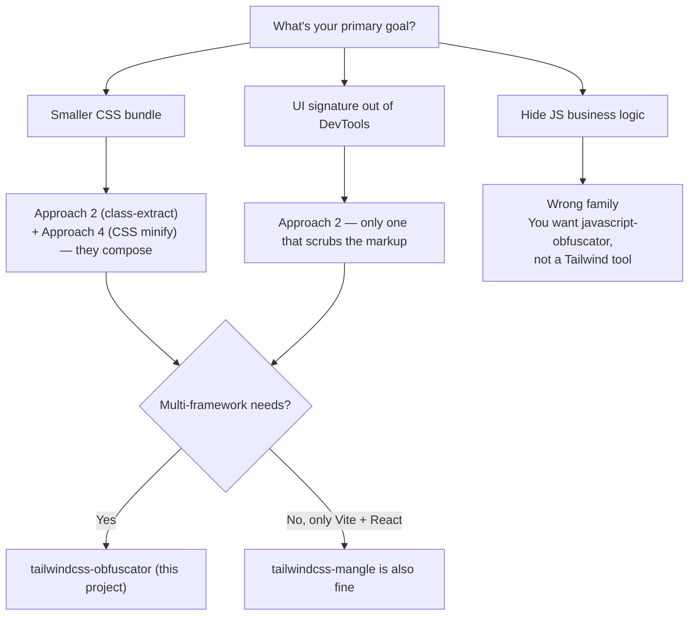

# Tailwind class transformation approaches

A technical, jargon-light comparison of the **four families of build-time Tailwind class transformation** in the wild — AST-based, class-extraction-based, per-string regex, and CSS-only. The goal is not to crown a winner ; it is to give you the vocabulary to pick the right tool for your specific constraint.

::: info Why this page exists
Three questions keep coming back in issues and discussions : _« How is this different from `tailwindcss-mangle` ? »_, _« Why not just use a CSS minifier ? »_, _« Is this an obfuscator or a mangler ? »_. The answers all hinge on **which family of transformation** the tool belongs to. This page is the long-form answer to those three questions in one place. The shorter project-by-project comparison lives at [Comparison](./comparison).
:::

## The four families

Every published Tailwind class transformer at the time of writing fits into one of four buckets. The differences matter because each family has a different blast radius (what can break) and a different ceiling (what bundle-size / protection win you can hope for).

### Approach 1 — AST-based per-utility obfuscation

**How it works.** Parse every JS / TS / JSX / Vue / Svelte file with a real AST (Babel, SWC, oxc, etc.). Walk the tree, identify each _string literal_ that _could_ be a class name (`className="…"`, `class="…"`, function call to `cn()` / `clsx()` / `cva()` / `tv()`), tokenise it into individual utilities, and emit the renamed string back through a code-mod transformer. CSS goes through a parallel PostCSS / lightningcss pass that rewrites selectors using the same mapping.

**Strengths.**

- Zero false positives from string lookalikes — only AST nodes that are _positionally_ class strings get rewritten.
- Handles unusual cases AST-aware : `className={['flex', cond && 'bg-red-500']}` is decomposed and rewritten correctly.
- Compatible with TypeScript template-literal types and per-framework dialects, because the parser already understands them.

**Weaknesses.**

- AST parsing is the most expensive step in any build pipeline ; doing it again for every file in a repo doubles the parse cost.
- Locks you to a specific AST library — when frameworks adopt a new syntax (the `<svelte:element>` tag, Vue 3's macros, JSX in MDX), you wait for parser upstream support.
- Truly dynamic classes (`` `bg-${color}-500` ``) are dead — the AST cannot statically resolve them, so they are silently skipped without warning.
- Per-framework adapters (`unplugin-vue`, `unplugin-svelte`) must each call into the AST layer, which means an N×M test matrix.

**Found in.** Internal compilers (the kind that ship inside enterprise build platforms), and academic / experimental projects that prioritise correctness over throughput.

### Approach 2 — Class extraction + per-utility mangling — _our approach_

**How it works.** A first pass scans every source file with **regex extractors** specialised per file type (`.tsx`, `.vue`, `.svelte`, `.html`, `.css`). The extractors locate class strings inside known structural shapes : `className="…"`, `:class="…"`, `class:…={…}`, function-call arguments to `cn()` / `clsx()` / `cva()` / `tv()` / etc. Each extracted string is tokenised into utilities, the global mapping is updated, and the file is re-written via context-aware regex transformers (one per file type). CSS gets a separate pass that rewrites selectors using the same mapping.

**Strengths.**

- Deterministic output — the mapping is persisted to `.tw-obfuscation/class-mapping.json` and reused across builds. Same input always produces the same output.
- Multi-framework by construction : adding a new framework means writing a new extractor + a new transformer, not touching the global pipeline.
- The mapping is **reversible** with the JSON file in hand. This is a property an obfuscator should NOT have, but a mangler MUST have for debugging — see the _« obfuscator vs mangler »_ note below.
- Build-tool agnostic via [unplugin](https://github.com/unjs/unplugin) — one plugin source, ten official adapters (Vite, Webpack, Rollup, esbuild, rspack, Farm, Nuxt, …).

**Weaknesses.**

- Truly dynamic class strings (`` `bg-${color}-500` ``) are not visible to the extractor and silently skipped — same limitation as the AST family. We document this prominently in [Static Classes Only](../guide/exclusions).
- Regex extractors are inherently « rule-driven » — a brand-new syntax (e.g. a new templating language adopted by a niche framework) needs a new extractor. The cost is one file ; the cost in the AST family is one new parser dependency.
- An exotic AST shape we did not anticipate (e.g. `clsx(...arr)` where `arr` is constructed in another file) is missed. Our solution : the explicit [`safelist`](../guide/options) option lets you force-rename classes the extractor can't see.

**Found in.** [`tailwindcss-obfuscator`](https://github.com/josedacosta/tailwindcss-obfuscator) (this project), [`tailwindcss-mangle`](https://github.com/sonofmagic/tailwindcss-mangle) (the closest analogue, with a slightly different framework coverage and a more limited multi-framework story).

### Approach 3 — Per-string regex rewrite + `@apply` re-emission

**How it works.** A simpler pipeline that reads HTML / JSX / Vue files as raw text, runs a regex over every quoted string that _could_ contain Tailwind class names, replaces each token with a short opaque identifier, and **emits a new CSS block where every short identifier is bound back to the original utility via `@apply`**. The class names in the bundle become `tw-a tw-b tw-c` ; the bundle CSS becomes `.tw-a { @apply bg-blue-500; } .tw-b { @apply px-4; }` etc.

**Strengths.**

- Trivial to integrate — no AST, no extractor library. A single Node script ; sometimes a few hundred lines total.
- Framework-neutral by construction (the script is just text-in, text-out).
- The user does not have to think about extractors / safelists / dynamic classes — every string with a class-shaped token gets rewritten.

**Weaknesses.**

- The `@apply` re-emission **inflates the CSS bundle** — every shortened identifier gets a fresh CSS rule, even when 50 components share the exact same utility list. The class-extraction approach merges those duplicates ; the `@apply` approach cannot.
- Two sources of truth (the rewritten HTML and the regenerated CSS) must stay synchronised. If one drifts (e.g. a developer manually edits the CSS), the bundle silently breaks.
- The regex is inherently lossy — strings that _look_ like class names but are not (Tailwind utility names embedded in a code example in a tutorial component, for instance) get wrongly rewritten.
- Coverage is limited to whichever framework the regex was tuned for — extending to a new framework means tuning the regex per-shape, which is exactly the maintenance burden the AST and class-extraction families pay once at parser / extractor level.

**Found in.** [Obfustail](https://obfustail.ui-layouts.com/) (the most polished implementation, scoped to Next.js + Tailwind v4).

### Approach 4 — CSS-only compression, no JS / HTML rewrite

**How it works.** Take the final CSS bundle (post-Tailwind, post-PurgeCSS) and run it through a minifier that **does not touch class names**. Whitespace gets collapsed, colours get shortened (`#ffffff` → `#fff`), empty rules get dropped, identical selectors get merged. The HTML / JSX bundle is untouched.

**Strengths.**

- Zero risk of breaking the DOM — class names in the markup never change.
- Works in any pipeline (PostCSS, Vite, Webpack, esbuild) as a final-step transform.
- A baseline you should ship even if you also use Approaches 1–3 — the families compose.

**Weaknesses.**

- Class names stay long (`.bg-blue-500`, `.hover:px-4`, …) — the gain is only from CSS-rule deduplication, never from identifier compression.
- Provides **zero design-system protection** — anyone who opens DevTools sees the full Tailwind vocabulary in the markup. If your motivation is « stop competitors from cloning my UI by copy-pasting classes », this family of tools does nothing for you.

**Found in.** [`cssnano`](https://github.com/cssnano/cssnano), [`csso`](https://github.com/css/csso), [`lightningcss`](https://github.com/parcel-bundler/lightningcss) (the modern Rust-based one bundled in Parcel and Vite). All three are excellent ; none of them is a class mangler.

## Side-by-side recap

| Criterion                                                          | AST per-utility   | Class-extract + mangle ⭐      | Per-string regex + `@apply`       | CSS-only      |
| ------------------------------------------------------------------ | ----------------- | ------------------------------ | --------------------------------- | ------------- |
| Bundle CSS shrinkage (typical)                                     | 30–60 %           | **30–60 %**                    | 5–15 % (inflates due to `@apply`) | 5–10 %        |
| Markup signature scrubbed (DevTools no longer reads `bg-blue-500`) | ✅                | **✅**                         | ✅                                | ❌            |
| Multi-framework support                                            | depends on parser | **✅ (10+ via unplugin)**      | scoped per implementation         | ✅ (CSS only) |
| Build cost overhead                                                | 🔴 high           | **🟡 moderate**                | 🟢 low                            | 🟢 low        |
| False-positive risk on lookalike strings                           | 🟢 zero           | 🟡 low (extractors are scoped) | 🔴 high (raw regex)               | 🟢 zero       |
| Two-source-of-truth risk                                           | 🟢 no             | **🟢 no**                      | 🔴 yes (`@apply` block must sync) | 🟢 no         |
| Reversibility (debug-friendly)                                     | yes (mapping)     | **yes (`class-mapping.json`)** | yes (mapping)                     | n/a           |
| Ceiling on dynamic classes                                         | 🔴 cannot         | 🟡 can (via `safelist`)        | 🟡 partial (regex catches more)   | 🟢 n/a        |

⭐ = where this project lives.

## Why we picked Approach 2

The class-extraction + per-utility mangling family is the only one that simultaneously :

1. Cuts the CSS bundle by **30–60 %** (Approach 4 cannot get there ; Approach 3 inflates).
2. Removes the Tailwind signature from the rendered HTML (Approach 4 leaves it visible).
3. Supports **every major framework** without a per-framework rewrite of the core pipeline (Approach 1 needs a new parser per framework ; Approach 3 needs a new regex tuning per framework).
4. Produces a **deterministic, reversible mapping** that lets the maintainer debug a production issue by re-mapping `tw-a` back to `bg-blue-500` in 30 seconds.

The trade-off we accept : truly dynamic class strings are skipped. We document this prominently in [Static Classes Only](../guide/exclusions) and mitigate it with the [`safelist`](../guide/options) option for the rare cases where the developer knows in advance which dynamic classes will exist at runtime.

## « Obfuscator » vs « mangler » — choosing the right word

The two terms are used interchangeably in the ecosystem, and we use both intentionally — but they describe two different concepts that both happen to apply to this project.

::: info Definitions

- **Mangler** is a term from JS minifiers / compilers (`UglifyJS`, `Terser`, `esbuild`, `swc`). The intention is **mechanical compression** : rename long identifiers to short ones to shrink the bundle. The transformation is deterministic, easily reversible if you have the mapping, and never claims to hide anything.
- **Obfuscator** is a term from security / DRM / anti-reverse-engineering (`javascript-obfuscator`, commercial tools). The intention is **to make the logic illegible** to a human reader : control-flow flattening, dead-code injection, identifier non-stable renaming, anti-debug hooks, string encryption.
  :::

**This project is technically a mangler.** We rename `bg-blue-500` to `tw-a`. The transformation is deterministic, the mapping is persisted to a JSON file, and reversal is a `git-blame`-friendly operation if you have the file. We use **none** of the techniques a real obfuscator deploys — no control-flow flattening, no string encryption, no anti-debug.

**The « obfuscator » label describes the side-effect, not the technique.** A reader who opens DevTools on an obfuscated bundle no longer sees `bg-blue-500 px-4 py-2 rounded-md` (which is a fingerprint that uniquely identifies a Tailwind project) — they see `tw-a tw-b tw-c tw-d`, which conveys nothing. That side-effect is genuinely useful : it raises the friction for automated UI scrapers, design-system clones, competitive copy-paste of utility patterns. It is **not a security guarantee** — anyone with patience and DevTools can reconstruct the mapping by clicking around. But it shifts the cost of UI cloning from « 30 seconds with a copy-paste » to « 30 minutes with a stylesheet inspector », which is a meaningful deterrent at the margin.

So when you compare us to `tailwindcss-mangle` : we do the same thing technically. When you compare us to `javascript-obfuscator` : we are not in the same business. The H1 of this project (« Tailwind CSS Obfuscator (a.k.a. Tailwind Class Mangler) ») is the honest summary — the SEO term is « obfuscator » (because that is what users search for when they want this side-effect), the technical term is « mangler » (because that is what the code actually does).

## Decision tree — which family should you pick ?

If you are in the « hide JS business logic » lane, this project is the wrong tool — pick a real JS obfuscator and accept the runtime overhead they entail.

## Want to dig deeper ?

- The full project-by-project comparison (versions, maintainer activity, framework coverage) lives at [Comparison](./comparison).
- The technical reason Tailwind upstream chose not to ship a native mangler is at [Why no native obfuscation ?](./why-no-native).
- The day-to-day operational guarantees we offer (deterministic mapping, idempotent rebuilds, no runtime cost) are documented at [Patterns](../reference/tailwind-patterns).
