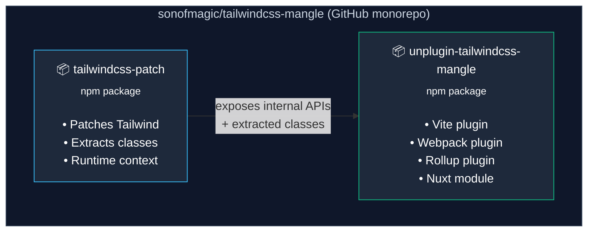

# Mangle Ecosystem

## Overview

The `tailwindcss-patch` and `unplugin-tailwindcss-mangle` packages are **two separate npm packages** but they are developed together in the **same GitHub monorepo**: [sonofmagic/tailwindcss-mangle](https://github.com/sonofmagic/tailwindcss-mangle).

## Package Relationship



## tailwindcss-patch

**npm**: https://www.npmjs.com/package/tailwindcss-patch

### Purpose

Patches Tailwind CSS source code at install time to expose internal APIs that are normally not accessible. This allows extracting the complete list of generated utility classes.

### How It Works

1. **Installation**: Run `npx tw-patch install` after installing Tailwind CSS
2. **Patching**: Modifies Tailwind's source files to expose the internal context
3. **Extraction**: Provides APIs to get all generated classes at runtime

### Key Features

- `TailwindcssPatcher` class for programmatic access
- `twPatcher.getContexts()` - Get all Tailwind contexts at runtime
- `twPatcher.getClassSet()` - Get all generated utility classes
- CLI tool: `npx tw-patch extract` creates `.tw-patch/tw-class-list.json`

### Tailwind Version Support

| tailwindcss-patch | Tailwind CSS |
| ----------------- | ------------ |
| v3.x              | v3.x         |
| v2.x              | v3.x (older) |

**Important**: As of now, `tailwindcss-patch` does NOT support Tailwind CSS v4 due to the complete architectural rewrite (Oxide engine in Rust).

## unplugin-tailwindcss-mangle

**npm**: https://www.npmjs.com/package/unplugin-tailwindcss-mangle

### Purpose

A build-time plugin that mangles (obfuscates) Tailwind CSS class names in your production build. It transforms readable class names into short, cryptic identifiers.

### Transformation Example

```html
<!-- Before -->
<div class="z-10 w-full max-w-5xl items-center justify-between font-mono text-sm lg:flex"></div>

<!-- After -->
<div class="tw-a tw-b tw-c tw-d tw-e tw-f tw-g tw-h"></div>
```

### Supported Build Tools

- **Vite** - `unplugin-tailwindcss-mangle/vite`
- **Webpack** - `unplugin-tailwindcss-mangle/webpack`
- **Rollup** - `unplugin-tailwindcss-mangle/rollup`
- **Nuxt 3** - `unplugin-tailwindcss-mangle/nuxt`

### Dependency on tailwindcss-patch

`unplugin-tailwindcss-mangle` requires `tailwindcss-patch` to be installed and configured first:

```bash
npm i -D unplugin-tailwindcss-mangle tailwindcss-patch
npx tw-patch install
```

### Limitations

1. **Production only**: Only works during build, not in development mode
2. **Static classes only**: Dynamic class construction (`bg-${color}-500`) breaks obfuscation
3. **Partial mangling**: Some simple classes like `flex`, `relative` are not mangled by default

## Monorepo Structure

The GitHub repository contains:

```
sonofmagic/tailwindcss-mangle/
├── packages/
│   ├── tailwindcss-patch/           # Core patching library
│   ├── unplugin-tailwindcss-mangle/ # Build plugins
│   ├── core/                        # Shared core logic
│   ├── config/                      # Configuration utilities
│   └── shared/                      # Shared utilities
├── apps/                            # Test applications
│   ├── next-app/
│   ├── nuxt-app/
│   ├── vite-react/
│   └── ...
└── website/                         # Documentation site
```

## Why This Matters for Our Project

Understanding this ecosystem is crucial for our `tailwindcss-obfuscator` because:

1. **Same problem domain**: We're solving the same problem (class obfuscation)
2. **Reference implementation**: Their approach to class extraction and transformation is valuable
3. **Tailwind v4 gap**: Neither package supports Tailwind v4 yet - this is our opportunity
4. **Architecture insights**: Their monorepo structure and plugin patterns are good references

## Key Differences from Our Approach

| Aspect            | tailwindcss-mangle | Our tailwindcss-obfuscator |
| ----------------- | ------------------ | -------------------------- |
| Tailwind v4       | Not supported      | Supported                  |
| Patching required | Yes (`tw-patch`)   | No                         |
| Class extraction  | Runtime via patch  | Static analysis            |
| Build tools       | unplugin-based     | unplugin-based             |

## Local Code for Reverse Engineering

We have downloaded the source code for analysis:

```
./jose/github/tailwindcss-mangle/packages/tailwindcss-patch/
./jose/github/tailwindcss-mangle/packages/unplugin-tailwindcss-mangle/
```

See `./jose/github/README.md` for download instructions (the `jose/` directory is gitignored — refresh with `pnpm dlx tsx jose/github/download_github_repositories.ts`).

## References

::: info External Links

- [tailwindcss-mangle GitHub](https://github.com/sonofmagic/tailwindcss-mangle) - Monorepo source code
- [tailwindcss-patch npm](https://www.npmjs.com/package/tailwindcss-patch) - NPM package
- [unplugin-tailwindcss-mangle npm](https://www.npmjs.com/package/unplugin-tailwindcss-mangle) - NPM package
- [Discussion on Tailwind CSS repo](https://github.com/tailwindlabs/tailwindcss/discussions/11179) - Community discussion
  :::
